# Sistema de Gestión Automotora

Sistema de gestión para una empresa automotora, implementado con arquitectura de microservicios. Cada servicio es independiente, con su propia base de datos MySQL, expone una API REST y se comunica con los demás mediante OpenFeign.

**Tablero Trello:** [https://trello.com/b/hMKFit71/duocuc-proyecto-automotora](https://trello.com/b/hMKFit71/duocuc-proyecto-automotora)

---

## Tech Stack

- Java 21
- Spring Boot 4
- Spring Cloud OpenFeign (comunicación entre servicios)
- Spring Cloud Gateway (API Gateway)
- Spring Security + JWT (autenticación)
- Resilience4j (Circuit Breaker)
- Spring Data JPA + Hibernate
- Flyway (migraciones de base de datos)
- MySQL
- Lombok
- Maven
- Docker / Docker Compose
- Springdoc OpenAPI (Swagger UI)

---

## Microservicios

| Servicio | Puerto | Base de Datos | Descripción |
|---|---|---|---|
| ms-auth | 9012 | db_auth | Autenticación JWT |
| ms-clients | 9001 | db_clients | Gestión de clientes |
| ms-sales | 9002 | db_sales | Gestión de ventas |
| ms-employees | 9003 | db_employees | Gestión de empleados |
| ms-vehicles | 9004 | db_vehicles | Gestión de vehículos |
| ms-inventory | 9005 | db_inventory | Gestión de inventario |
| ms-test-drive | 9006 | db_test_drive | Gestión de pruebas de manejo |
| ms-suppliers | 9007 | db_suppliers | Gestión de proveedores |
| ms-delivery | 9008 | db_delivery | Gestión de entregas |
| ms-branches | 9009 | db_branches | Gestión de sucursales |
| ms-insurances | 9010 | db_insurances | Gestión de seguros |
| ms-gateway | 8080 | — | API Gateway (punto de entrada único) |

---

## Comunicación entre servicios (Feign)

| Servicio | Consulta a |
|---|---|
| ms-sales | ms-clients, ms-vehicles, ms-employees |
| ms-delivery | ms-sales, ms-clients |
| ms-employees | ms-branches |
| ms-insurances | ms-clients, ms-vehicles |
| ms-inventory | ms-vehicles |
| ms-test-drive | ms-clients, ms-vehicles |

---

## API Gateway

El microservicio `ms-gateway` actúa como punto de entrada único al sistema. Todas las peticiones externas pasan por él y son enrutadas al servicio correspondiente.

- Puerto local: `8080`
- Puerto Docker: `8085`

| Path | Enruta a |
|---|---|
| `/auth/**` | ms-auth |
| `/api/v1/clients/**` | ms-clients |
| `/api/v1/sales/**` | ms-sales |
| `/api/v1/employees/**` | ms-employees |
| `/api/v1/vehicles/**` | ms-vehicles |
| `/api/v1/inventory/**` | ms-inventory |
| `/api/v1/test-drive/**` | ms-test-drive |
| `/api/v1/suppliers/**` | ms-suppliers |
| `/api/v1/delivery/**` | ms-delivery |
| `/api/v1/branches/**` | ms-branches |
| `/api/v1/insurances/**` | ms-insurances |

---

## Swagger UI

Todos los microservicios exponen documentación interactiva con Swagger. Una vez levantado un servicio, acceder a:

```
http://localhost:{puerto}/doc/swagger-ui.html
```

Ejemplos:
- ms-clients: `http://localhost:9001/doc/swagger-ui.html`
- ms-sales: `http://localhost:9002/doc/swagger-ui.html`
- ms-auth: `http://localhost:9012/doc/swagger-ui.html`

---

## Circuit Breaker

Los microservicios que dependen de otros via Feign tienen Resilience4j configurado como Circuit Breaker. Si un servicio dependiente no está disponible, el circuit breaker evita la cascada de errores retornando una respuesta controlada.

Servicios con Circuit Breaker: `ms-sales`, `ms-delivery`, `ms-insurances`, `ms-inventory`, `ms-test-drive`.

---

## Docker

El proyecto incluye un `docker-compose.yml` que levanta todos los microservicios y una instancia de MySQL en una red interna compartida.

### Requisitos

- Docker y Docker Compose instalados
- Crear un archivo `.env` en la raíz con las siguientes variables:

```env
MYSQL_ROOT_PASSWORD=tu_password
JWT_SECRET=tu_secreto_jwt
```

### Levantar todo el sistema

```bash
docker compose up --build
```

MySQL queda expuesto en el puerto `3307` del host (para no colisionar con una instalación local en `3306`). El gateway queda en `http://localhost:8085`.

### Detener

```bash
docker compose down
```

---

## Pruebas unitarias

Se implementaron pruebas unitarias con JUnit 5 y Mockito para la capa de servicio de los siguientes microservicios:

- `ms-branches` — `BranchServiceImplTest`
- `ms-clients` — `ClientServiceImplTest`
- `ms-delivery` — `DeliveryServiceImplTest`
- `ms-employees` — `EmployeeServiceImplTest`
- `ms-insurances` — `InsuranceServiceImplTest`
- `ms-inventory` — `InventoryServiceImplTest`
- `ms-sales` — `SaleServiceImplTest`
- `ms-suppliers` — `SupplierServiceImplTest`
- `ms-test-drive` — `TestDriveServiceImplTest`
- `ms-vehicles` — `VehicleServiceImplTest`

Para correr las pruebas desde la carpeta de cada microservicio:

```bash
./mvnw test
```

---

## Requisitos previos

- Java 21+
- Maven 3.8+
- MySQL 8.0+ (corriendo en `localhost:3306`)
- Crear las bases de datos antes de iniciar cada servicio:

```sql
CREATE DATABASE db_auth;
CREATE DATABASE db_clients;
CREATE DATABASE db_sales;
CREATE DATABASE db_employees;
CREATE DATABASE db_vehicles;
CREATE DATABASE db_inventory;
CREATE DATABASE db_test_drive;
CREATE DATABASE db_suppliers;
CREATE DATABASE db_delivery;
CREATE DATABASE db_branches;
CREATE DATABASE db_insurances;
```

Las tablas y datos iniciales son creados automáticamente por **Flyway** al iniciar cada servicio.

---

## Cómo ejecutar

Desde la carpeta de cada microservicio:

```bash
mvn spring-boot:run
```

Se recomienda iniciar en este orden para que las validaciones Feign funcionen correctamente:

1. `ms-branches` (no depende de nadie)
2. `ms-clients` (no depende de nadie)
3. `ms-vehicles` (no depende de nadie)
4. `ms-suppliers` (no depende de nadie)
5. `ms-employees` (depende de ms-branches)
6. `ms-sales` (depende de ms-clients, ms-vehicles, ms-employees)
7. `ms-inventory` (depende de ms-vehicles)
8. `ms-test-drive` (depende de ms-clients, ms-vehicles)
9. `ms-insurances` (depende de ms-clients, ms-vehicles)
10. `ms-delivery` (depende de ms-sales, ms-clients)

---

## Endpoints API

Todos los servicios siguen el mismo patrón REST bajo `/api/v1/{recurso}`.

### ms-clients — `localhost:9001`
| Método | Endpoint | Descripción |
|---|---|---|
| GET | `/api/v1/clients` | Listar todos los clientes |
| GET | `/api/v1/clients/{id}` | Obtener cliente por ID |
| POST | `/api/v1/clients` | Crear cliente |
| PUT | `/api/v1/clients/{id}` | Actualizar cliente |
| DELETE | `/api/v1/clients/{id}` | Eliminar cliente |

### ms-sales — `localhost:9002`
| Método | Endpoint | Descripción |
|---|---|---|
| GET | `/api/v1/sales` | Listar todas las ventas |
| GET | `/api/v1/sales/{id}` | Obtener venta por ID |
| POST | `/api/v1/sales` | Crear venta |
| PUT | `/api/v1/sales/{id}` | Actualizar venta |
| DELETE | `/api/v1/sales/{id}` | Eliminar venta |

### ms-employees — `localhost:9003`
| Método | Endpoint | Descripción |
|---|---|---|
| GET | `/api/v1/employees` | Listar todos los empleados |
| GET | `/api/v1/employees/{id}` | Obtener empleado por ID |
| POST | `/api/v1/employees` | Crear empleado |
| PUT | `/api/v1/employees/{id}` | Actualizar empleado |
| DELETE | `/api/v1/employees/{id}` | Eliminar empleado |

### ms-vehicles — `localhost:9004`
| Método | Endpoint | Descripción |
|---|---|---|
| GET | `/api/v1/vehicles` | Listar todos los vehículos |
| GET | `/api/v1/vehicles/{id}` | Obtener vehículo por ID |
| POST | `/api/v1/vehicles` | Crear vehículo |
| PUT | `/api/v1/vehicles/{id}` | Actualizar vehículo |
| DELETE | `/api/v1/vehicles/{id}` | Eliminar vehículo |

### ms-inventory — `localhost:9005`
| Método | Endpoint | Descripción |
|---|---|---|
| GET | `/api/v1/inventory` | Listar todo el inventario |
| GET | `/api/v1/inventory/{id}` | Obtener ítem por ID |
| POST | `/api/v1/inventory` | Crear ítem de inventario |
| PUT | `/api/v1/inventory/{id}` | Actualizar ítem |
| DELETE | `/api/v1/inventory/{id}` | Eliminar ítem |

### ms-test-drive — `localhost:9006`
| Método | Endpoint | Descripción |
|---|---|---|
| GET | `/api/v1/test-drives` | Listar todas las visitas |
| GET | `/api/v1/test-drives/{id}` | Obtener visita por ID |
| POST | `/api/v1/test-drives` | Registrar visita |
| PUT | `/api/v1/test-drives/{id}` | Actualizar visita |
| DELETE | `/api/v1/test-drives/{id}` | Eliminar visita |

### ms-suppliers — `localhost:9007`
| Método | Endpoint | Descripción |
|---|---|---|
| GET | `/api/v1/suppliers` | Listar todos los proveedores |
| GET | `/api/v1/suppliers/{id}` | Obtener proveedor por ID |
| POST | `/api/v1/suppliers` | Crear proveedor |
| PUT | `/api/v1/suppliers/{id}` | Actualizar proveedor |
| DELETE | `/api/v1/suppliers/{id}` | Eliminar proveedor |

### ms-delivery — `localhost:9008`
| Método | Endpoint | Descripción |
|---|---|---|
| GET | `/api/v1/deliveries` | Listar todas las entregas |
| GET | `/api/v1/deliveries/{id}` | Obtener entrega por ID |
| POST | `/api/v1/deliveries` | Registrar entrega |
| PUT | `/api/v1/deliveries/{id}` | Actualizar entrega |
| DELETE | `/api/v1/deliveries/{id}` | Eliminar entrega |

### ms-branches — `localhost:9009`
| Método | Endpoint | Descripción |
|---|---|---|
| GET | `/api/v1/branches` | Listar todas las sucursales |
| GET | `/api/v1/branches/{id}` | Obtener sucursal por ID |
| POST | `/api/v1/branches` | Crear sucursal |
| PUT | `/api/v1/branches/{id}` | Actualizar sucursal |
| DELETE | `/api/v1/branches/{id}` | Eliminar sucursal |

### ms-insurances — `localhost:9010`
| Método | Endpoint | Descripción |
|---|---|---|
| GET | `/api/v1/insurances` | Listar todos los seguros |
| GET | `/api/v1/insurances/{id}` | Obtener seguro por ID |
| POST | `/api/v1/insurances` | Crear seguro |
| PUT | `/api/v1/insurances/{id}` | Actualizar seguro |
| DELETE | `/api/v1/insurances/{id}` | Eliminar seguro |

---

## Manejo de errores

Todos los servicios retornan errores con mensajes en español.

### Errores de validación — `400 Bad Request`
```json
{
  "paymentType": "El tipo de pago no puede estar vacío",
  "clientId": "El ID del cliente es requerido"
}
```

### Recurso no encontrado — `404 Not Found`
```json
{
  "error": "Cliente con id 99 no existe"
}
```

### Error interno — `500 Internal Server Error`
```json
{
  "error": "descripción del error"
}
```

---

## Diagramas Entidad-Relación (DER)

> Las relaciones entre entidades de distintos microservicios son **lógicas** (validadas por la aplicación vía Feign), no físicas a nivel de base de datos, ya que cada servicio posee su propia base de datos independiente.

### DER Global — Vista conceptual

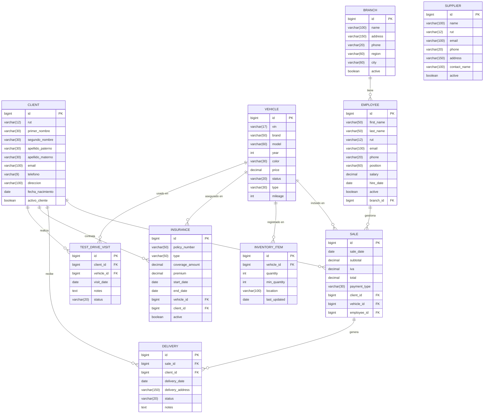

---

### DER por microservicio

#### ms-branches (db_branches)

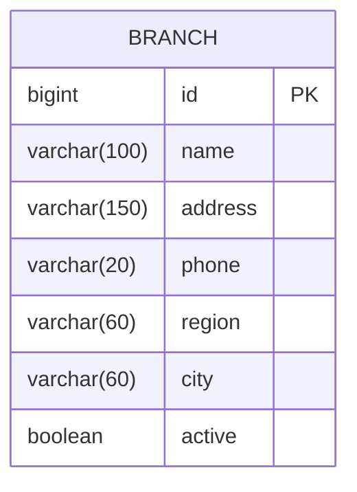

#### ms-clients (db_clients)

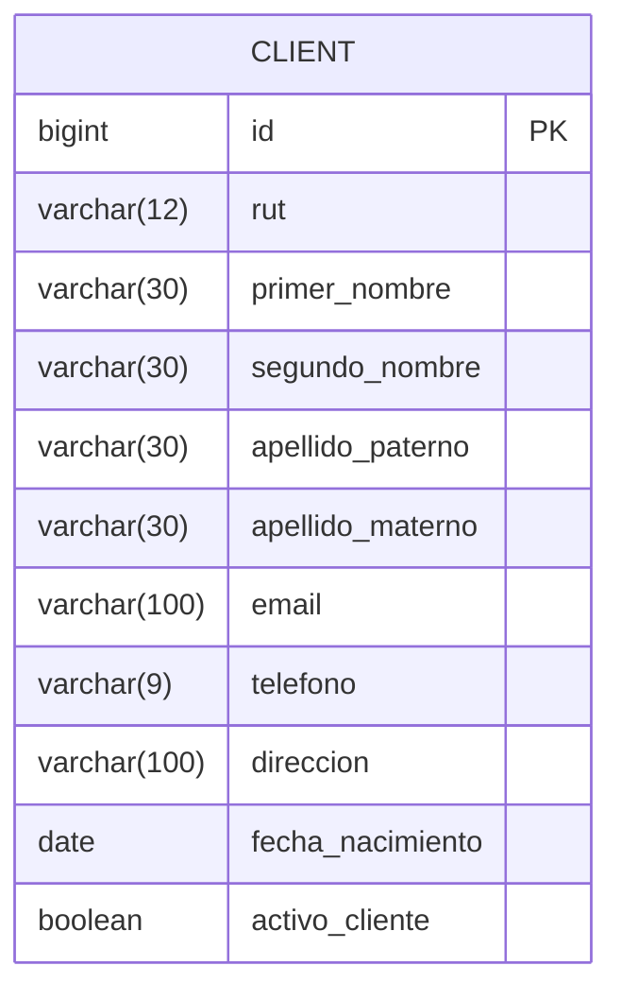

#### ms-vehicles (db_vehicles)

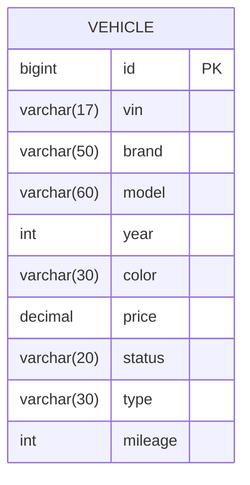

#### ms-suppliers (db_suppliers)

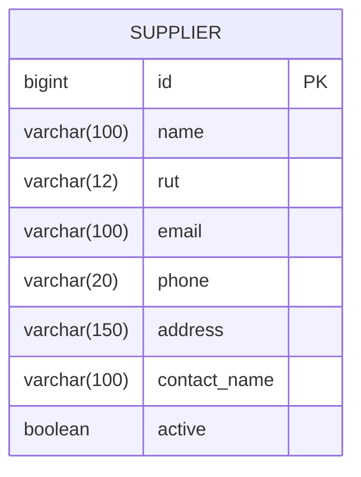

#### ms-employees (db_employees)

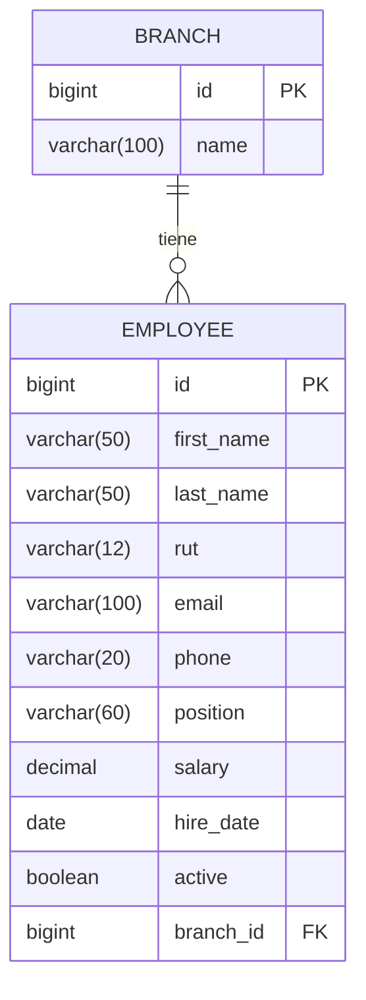

#### ms-sales (db_sales)

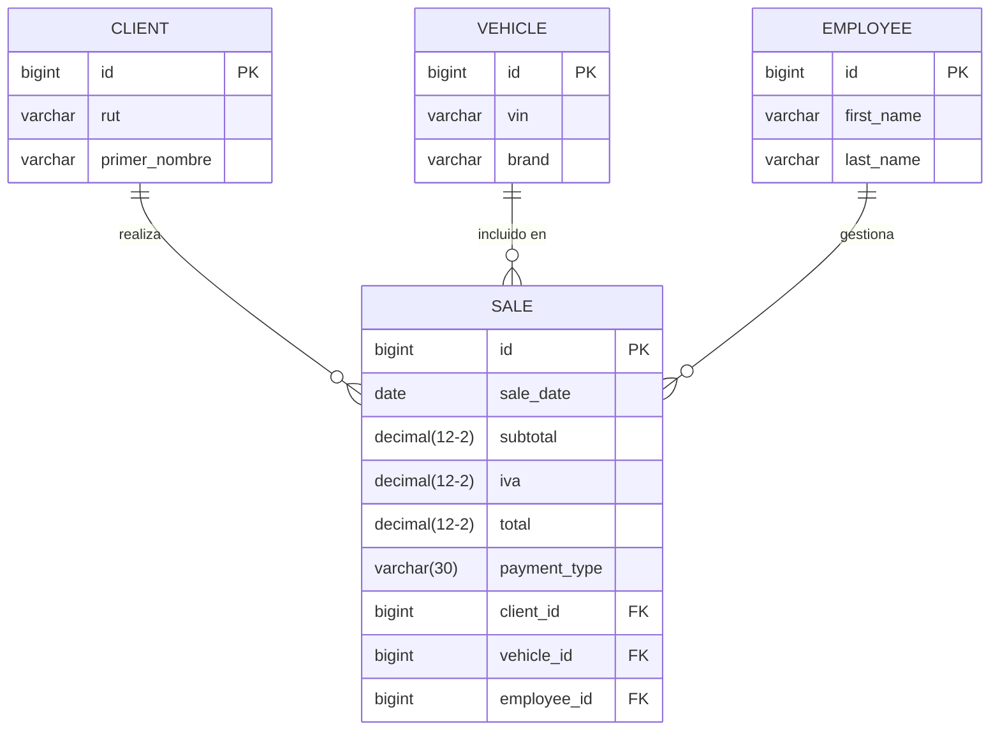

#### ms-delivery (db_delivery)

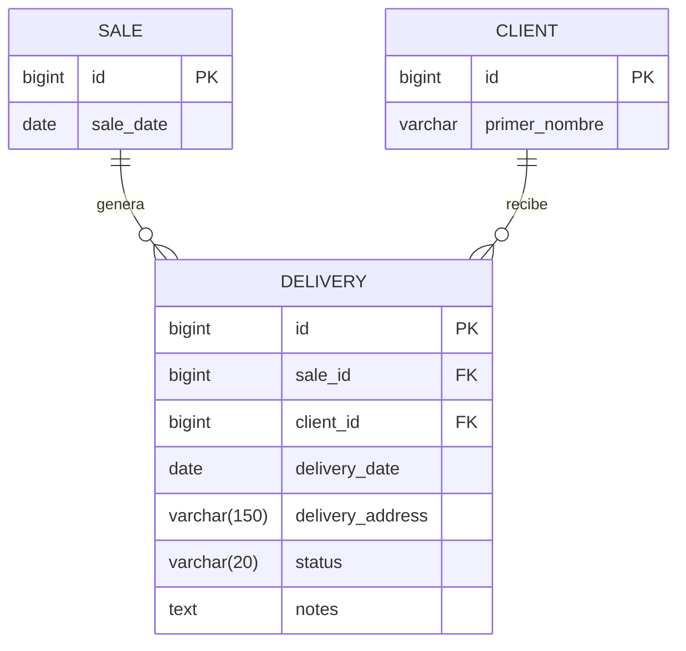

#### ms-inventory (db_inventory)

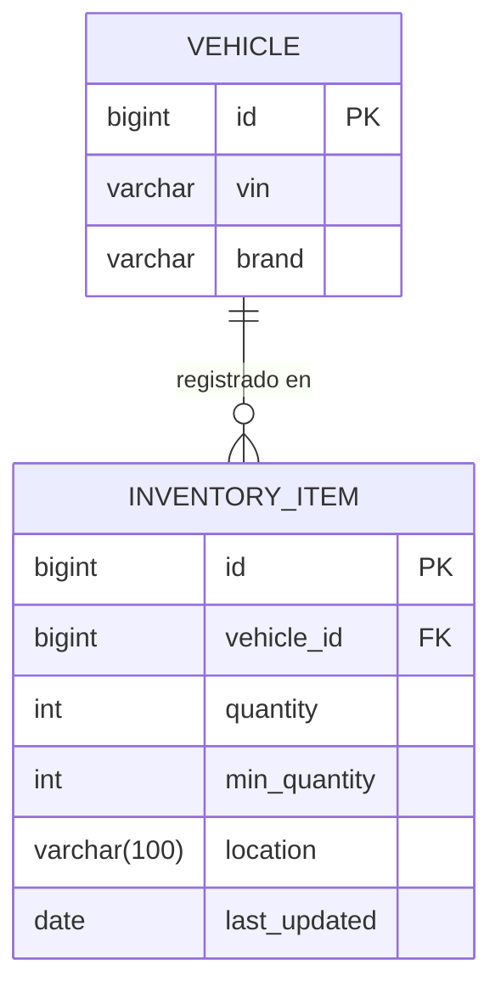

#### ms-test-drive (db_test_drive)

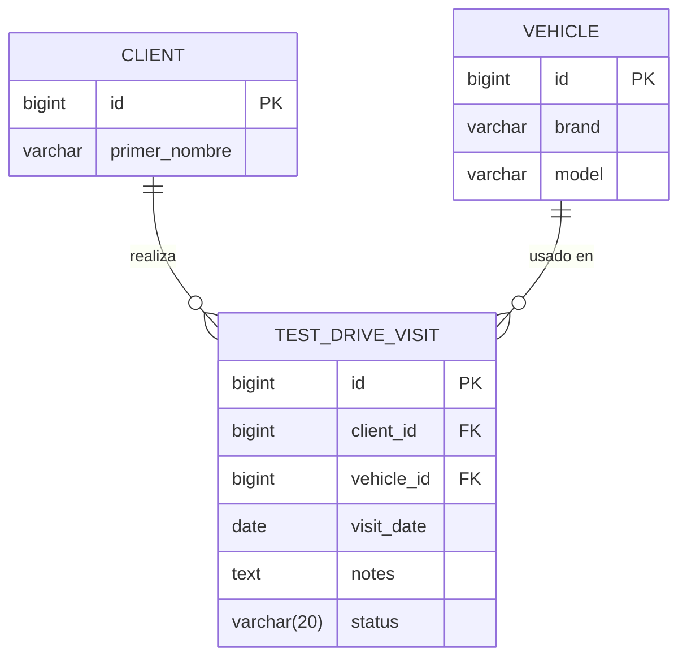

#### ms-insurances (db_insurances)

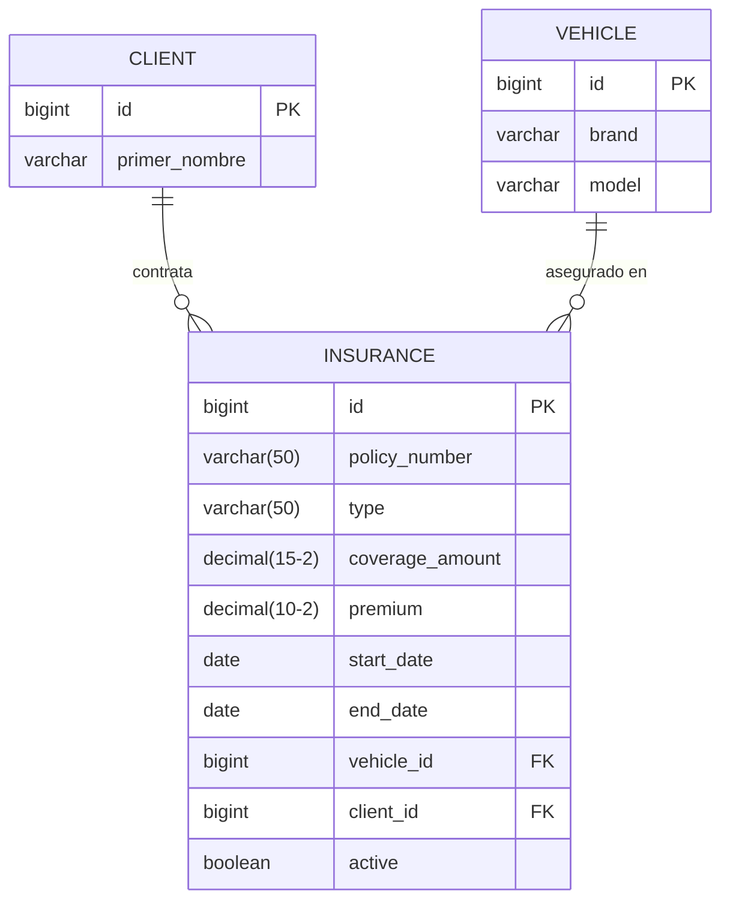
